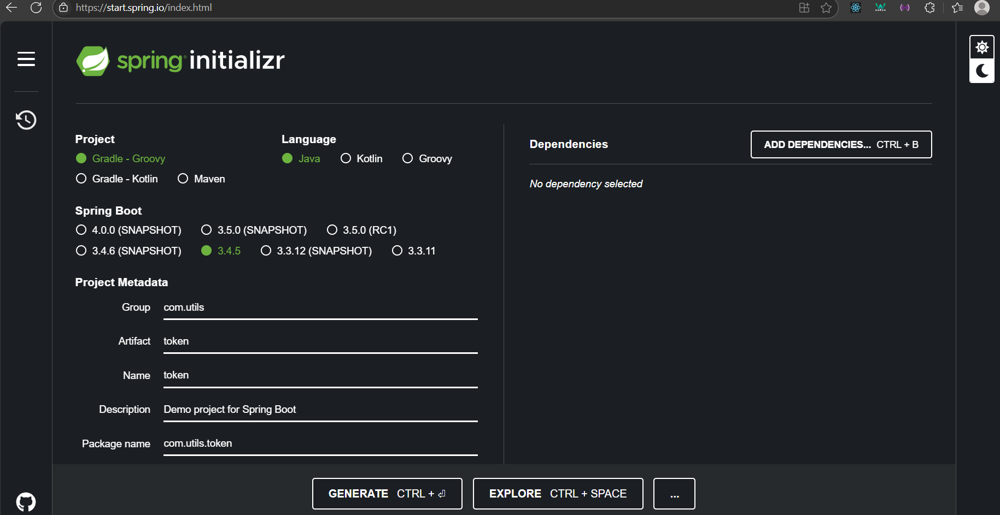

# Overview
## **Step to step to build a simple JAR file in local to use in multi local project by maven-publish**
***
### 1. The first step is create your java
   Go to <https://start.spring.io> and create your project
        

***
### 2. Open your project and open file build.gradle to set up

Below is my build.gradle
```gradle
//Add your plugins
plugins {
id 'java' 
id 'org.springframework.boot' version '3.4.4'
id 'io.spring.dependency-management' version '1.1.6'
id 'maven-publish'  //Currently use maven-publish to build jar file
}

//Group and version of your project
group = 'com.utils'
version = '0.0.1-SNAPSHOT'

java {
sourceCompatibility = JavaVersion.VERSION_21 // Or your Java version
}

//Destination your project download dependencies declared in dependencies block
repositories {
qmavenCentral()
}

//Your dependency
dependencies {
    implementation 'org.springframework.boot:spring-boot-starter'
    implementation 'org.springframework.boot:spring-boot-starter-web'
    implementation 'org.springframework.boot:spring-boot-starter-actuator'
    implementation 'com.nimbusds:nimbus-jose-jwt:9.37'
    compileOnly 'org.projectlombok:lombok:1.18.34'
    annotationProcessor 'org.projectlombok:lombok:1.18.34'
    testImplementation 'org.springframework.boot:spring-boot-starter-test'
    testRuntimeOnly 'org.junit.platform:junit-platform-launcher'
}

//Test destination and your test platform
tasks.named('test') {
    useJUnitPlatform()
}

//Define for library information
publishing {
    publications {
        mavenJava(MavenPublication) {
        //GroupId, artifactId and version of your JAR file will expose
        groupId = 'com.utils'
        artifactId = 'token-utils'
        version = '0.0.4-SNAPSHOT'
        from components.java
		    pom {
		        //Name of library, appear in POM to describe your library
			    name = 'Token Utils Library'
			    //Detail describe about function of library
			    description = 'A utility library for generating and validating JWT tokens.'
		    	//Url of project, often redirect to document of library 
		    	url = ''
		    	//Infomation about licenses of library
			    licenses {
				    license {
					    name = 'The Apache License, Version 2.0'
					    url = 'http://www.apache.org/licenses/LICENSE-2.0.txt'
				    }
		    	}
		    	//Information about developer of library
			    developers {
				    developer {
					    id = 'hoangtuyen04'
					    name = 'Hoang Tuyen'
	    				email = 'gradle@gmail.com'
		    		}
			    }
	    	}
	    }
    }
    
    repositories {
	    mavenLocal() // Publishes to your local Maven repository (~/.m2/repository)
    }
}
```
***
### 3. Create your class and function you want to build

Below is an example about TokenUtils class used to create, generate, and verify token
```java
public class TokenUtils {
    private final String signerKey;
    public TokenUtils (String signerKey) {
        this.signerKey = signerKey;
    }

    public String getUserIdByToken(String token) throws ParseException {
        SignedJWT signedJWT;
        try {
            signedJWT = SignedJWT.parse(token);
        } catch (ParseException e) {
            return null;
        }
        return signedJWT.getJWTClaimsSet().getSubject();
    }


    public boolean checkToken(String token) throws JOSEException, ParseException {
        JWSVerifier verifier = new MACVerifier(signerKey.getBytes());
        SignedJWT signedJWT = SignedJWT.parse(token);
        Date expiryTime = signedJWT.getJWTClaimsSet().getExpirationTime();
        boolean verified = signedJWT.verify(verifier);
        return verified && expiryTime.after(new Date());
    }

    public String isValidToken(String userId, List<String> roles) throws JOSEException {
        JWSHeader jwsHeader = new JWSHeader(JWSAlgorithm.HS512);
        JWTClaimsSet jwtClaimsSet;
        jwtClaimsSet = new JWTClaimsSet.Builder()
                .issuer("issuer")
                .subject(userId)
                .issueTime(new Date())
                .expirationTime(Date.from(Instant.now().plus(24*60*60, ChronoUnit.SECONDS)))
                .jwtID(UUID.randomUUID().toString())
                .claim("roles",buildRoles(roles))
                .build();
        JWSObject jwsObject = new JWSObject(jwsHeader, new Payload(jwtClaimsSet.toJSONObject()));
        jwsObject.sign(new MACSigner(signerKey.getBytes()));
        String token =  jwsObject.serialize();
        return token;
    }

    private List<String> buildRoles(List<String> roles) {
        return roles;
    }
}
```
***
### 4. And to clear and build a new jar file run this in cmd
```
./gradlew clean build publishToMavenLocal
```
***
### 5. To check jar file, open .m2 and check your jar file
***
### 6. To use this jar file in other local project you just add this code in build.gradle file
+ To find the published JAR in local
```gradle
repositories {
	mavenLocal() 
}
```
+ implement your JAR file
```gradle
implementation 'com.utils:token-utils:0.0.5-SNAPSHOT'
```
***
